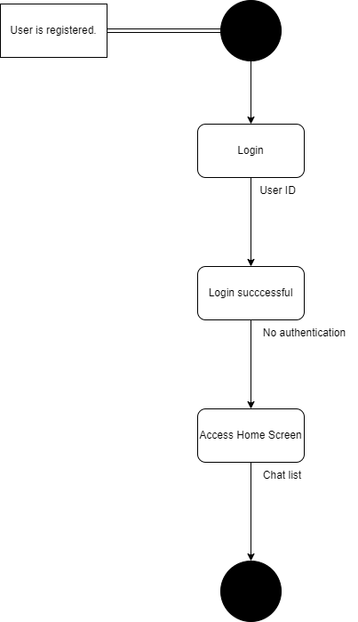

  
  

Use Case description:
  User sends a message and destination to the system. The system verifies if the provided User ID is valid. If the User ID is valid, the system attempts to establish a connection. Once a connection is established, the system checks for an active socket connection. If the socket connection is active, the system forwards the message to the recipient. If the User ID is invalid or if there is no active connection, the system does not forward the message.

  
  

Use Case description:

  
  

Use Case description:

  
  

Use Case description:
